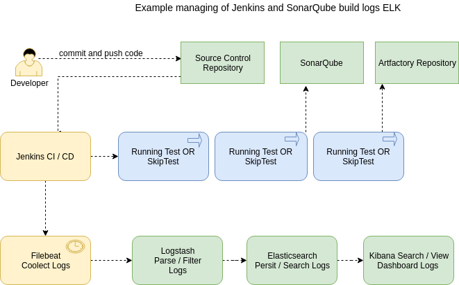

## Docker Tools Stack
Repository for running docker-compose with Jenkins, Nexus3, Jfrog Artifactory-oss, SonarQube and ELK

## Architecture
<p align="center">
  
</p>

<p align="center">
  
</p>

## How To

#### Step 1 (Up Nexus 3)

$ docker-compose -f nexus3-compose.yml up -d

#### Step 2 (Up Jfrog Artifactory)

$ docker-compose -f artifactory-oss.yml up -d

#### Step 3 (Up Jenkins and Sonarqube)

$ docker-compose up -d

## Warning
```
if the Jenkins of the following permission error
/var/jenkins_home/copy_reference_file.log’: Permission denied 
Execute: chown -R 1000:1000 jenkins-stack-tools/
````

## Quick Start Stack ELK

- On application host go to `beats` directory and start Filebeat with Docker Compose:
````
$ cd beats
$ docker-compose up -d
````

- On the ELK host go to `elk` directory and start ELK stack with Docker compose:
```
$ cd elk
$ docker-compose up -d
````

## Open Browser Applications

- Nexus dashboard URL: http://localhost:1000
- Login and Password Default: 
```
user: admin
password: admin123
```

- Jenkins dashboard URL: http://localhost:2000
- To access the password from the container:
```
docker exec -it jenkins bash
cat /var/jenkins_home/secrets/initialAdminPassword
```

- SonarQube dashboard URL: https://localhost:3000
- Login and Password Default: 
```
user: admin
password: admin
````

- Jfrog Artifactory dashboard URL: http://localhost:4000

- ELK dashboard > Kibana URL: https://localhost:5001